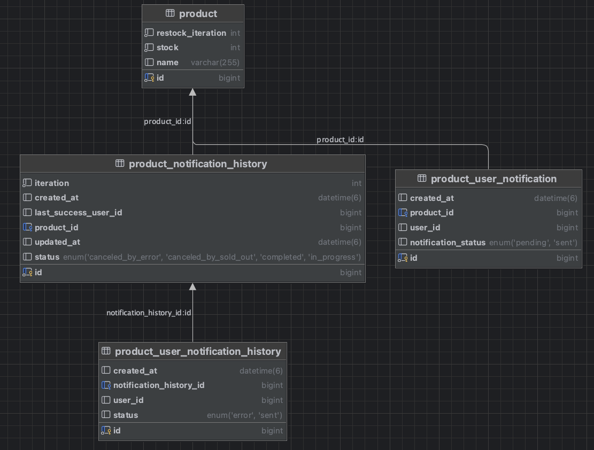

## Quick Start
```
git clone https://github.com/polar7bear/enterprise-assignment-2.git

cd assignment2

docker-compose up
```
## Features

1. 재입고 알림 전송 
   - 재입고 되었을 때, 재입고 알림을 설정한 유저들에게 알림을 순차적으로 전송합니다.
   - 알림 전송 중 재고가 모두 소진되면 알림 전송을 중단합니다.
   - 알림 전송 전 상품의 재입고 회차를 1 증가시킵니다.
   - 알림을 받은 유저 목록을 DB에 기록합니다.

2. 재입고 알림 수동 전송
   - 예외로 인해 알림 전송이 실패한 경우, 수동으로 알림을 다시 전송할 수 있습니다.
   - 수동 전송 시 마지막으로 성공한 유저 이후의 유저들에게만 알림을 전송합니다.

3. 알림 전송 제한
   - 1초에 최대 500개의 요청을 처리할 수 있도록 Resilience4j의 RateLimiter를 사용하여 알림 전송 속도를 제한합니다.

### 비즈니스 요구사항
- 알림 메시지 전송 순서: 재입고 알림을 설정한 유저 순서대로 알림 메시지를 전송해야 합니다.
- 소진 시 중단: 재입고 알림을 보내던 중 재고가 모두 소진되면 알림 전송을 중단합니다.
- 전송 상태 저장: 알림 전송의 상태를 DB에 저장해야 합니다. 상태는 아래와 같습니다:
  - PROGRESS (발송 중)
  - CANCELED_BY_SOLD_OUT (품절에 의한 발송 중단)
  - CANCELED_BY_ERROR (예외에 의한 발송 중단)
  - COMPLETED (완료)

### 기술적 요구사항
- 알림 메시지는 1초에 최대 500개의 요청만 처리할 수 있습니다.
- 인덱스를 효율적으로 탈 수 있도록 테이블을 설계해야 합니다.

## 테이블 설계


<br>
<Br>

## API 명세

1. 재입고 알림 전송 API

- URL: /products/{productId}/notifications/re-stock
- Method: POST
- Request Body: 없음

2. 재입고 알림 수동 전송 API

- URL: /admin/products/{productId}/notifications/re-stock
- Method: POST
- Request Body: 없음

<br>
<br>

#### 재입고 알림 전송 API
```java
@Transactional
    @RateLimiter(name = "send-notification")
    public void sendRestockNotification(Long productId) {
        Product product = productRepository.findById(productId)
                .orElseThrow(() -> new RuntimeException("존재하지 않는 상품입니다."));

        product.incrementRestockIteration();
        productRepository.save(product);

        ProductNotificationHistory history = new ProductNotificationHistory(
                product,
                product.getRestockIteration(),
                NotificationHistoryStatus.IN_PROGRESS);

        productNotificationHistoryRepository.save(history);

        List<ProductUserNotification> notifications = productUserNotificationRepository
                .findByProductIdAndNotificationStatus(productId, NotificationStatus.PENDING);

        processNotification(history, notifications, product);
    }
```
- RateLimiter 적용: @RateLimiter(name = "send-notification")을 사용하여 sendRestockNotification 메서드에 Resilience4j RateLimiter를 적용했습니다. 이 메서드는 재입고 시 재입고 알림을 설정한 유저들에게 알림 메시지를 보내는 로직입니다.
- 재입고된 상품의 회차를 증가시키고, 해당 상품에 대한 알림이 필요한 유저들을 찾아 알림을 전송합니다.
- 전송 속도 제한: 초당 500건의 요청으로 제한되므로, 대량의 알림 요청이 발생해도 RateLimiter를 통해 일정 속도로 처리할 수 있습니다.

<br>
<br>

#### 재입고 알림 전송 API(manual)
```java
@Transactional
    @RateLimiter(name = "send-notification")
    public void sendManualRestockNotification(Long productId) {
        ProductNotificationHistory history = productNotificationHistoryRepository
                .findByIdAndStatusOrderByCreatedAtAsc(productId, NotificationHistoryStatus.CANCELED_BY_ERROR)
                .orElseThrow(() -> new RuntimeException("실패한 알림 기록이 없습니다."));

        List<ProductUserNotification> notifications = productUserNotificationRepository
                .findByProductIdAndNotificationStatusAfterId(productId, NotificationStatus.PENDING, history.getLastSuccessUserId());

        Product product = history.getProduct();
        processNotification(history, notifications, product);
    }
```
- RateLimiter 적용: @RateLimiter(name = "send-notification")을 사용하여 수동 재입고 알림 전송에도 동일한 제한을 적용했습니다.
- 전송 로직: 만약 예외가 발생하여 알림 전송이 실패했을 경우, 마지막으로 성공한 유저 이후부터 다시 알림을 전송합니다. 이를 위해 실패한 기록을 기반으로 남은 유저들에게 알림을 보냅니다.
- 전송 속도 제한: 이 메서드도 초당 500건으로 제한됩니다.

<br>
<br>

#### 재입고 알림 전송 공통 로직
```java
private void processNotification(ProductNotificationHistory history, List<ProductUserNotification> notifications, Product product) {
        for (ProductUserNotification notification : notifications) {
            if (emptyStock(product, history)) return;

            try {
                sendSuccess(notification, history, product);
            } catch (Exception e) {
                cancleByError(notification, history);
            }
        }
        history.markAsCompleted();
        productNotificationHistoryRepository.save(history);
    }

    private void sendSuccess(ProductUserNotification notification, ProductNotificationHistory history, Product product) {
        sendNotificationUser(notification.getUserId());
        ProductUserNotificationHistory notificationHistory = new ProductUserNotificationHistory(
                history, notification.getUserId(), NotificationSendStatus.SENT);
        productUserNotificationHistoryRepository.save(notificationHistory);

        notification.markAsSent();
        productUserNotificationRepository.save(notification);

        productRepository.save(product);
    }

    private void cancleByError(ProductUserNotification notification, ProductNotificationHistory history) {
        ProductUserNotificationHistory notificationHistory = new ProductUserNotificationHistory(
                history, notification.getId(), NotificationSendStatus.ERROR);
        productUserNotificationHistoryRepository.save(notificationHistory);
        history.markAsCanceledByError();
        history.recordLastSuccessId(notification.getUserId());
        productNotificationHistoryRepository.save(history);
        throw new RuntimeException("알림 전송 중 오류가 발생하였습니다.");
    }

    private boolean emptyStock(Product product, ProductNotificationHistory history) {
        if (product.getStock() <= 0) {
            history.markAsCanceledBySoldOut();
            productNotificationHistoryRepository.save(history);
            return true;
        }
        return false;
    }

    public void sendNotificationUser(Long userId) {
        System.out.println("유저 " + userId + "에게 상품 재입고 알림을 전송하였습니다.");
    }
```
- 공통 로직: 
  - processNotification 메서드는 재입고 알림 전송의 핵심 로직을 담당합니다. 모든 재입고 알림 전송 시 이 로직이 호출됩니다.
  - sendSuccess: 알림 전송에 성공했을 때의 처리를 담당합니다.
  - cancleByError: 알림 전송 중 예외가 발생하면, 예외 처리 후 상태를 기록합니다.
  - emptyStock: 상품의 재고가 소진되면 알림 전송을 중단합니다.

    
<br>
<br>

#### RateLimiter 적용
Resilience4j의 RateLimiter를 사용
```yml
resilience4j:
  ratelimiter:
    instances:
      send-notification:
        limit-for-period: 500
        limit-refresh-period: 1s
        timeout-duration: 0s
```
위와 같이 1초당 500건의 요청을 받도록 제한


